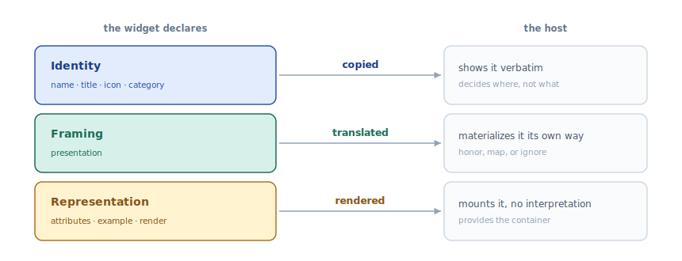
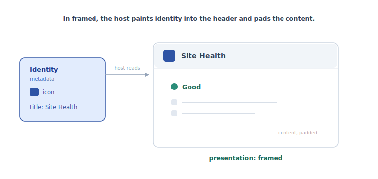
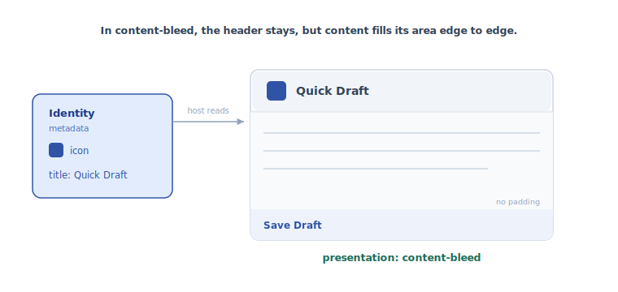
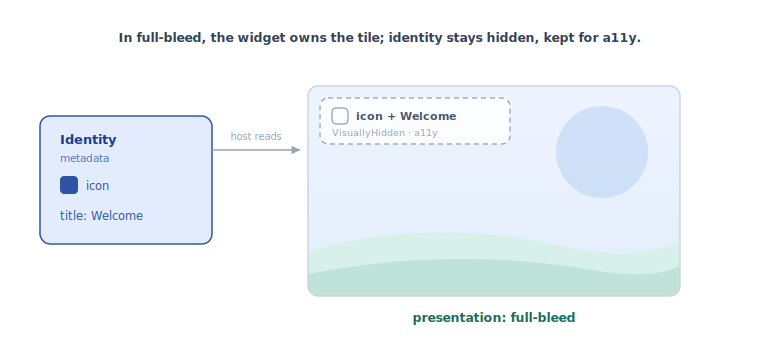
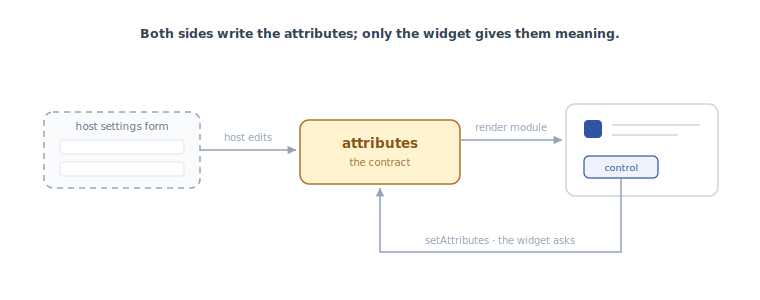

# Anatomy of a widget type

This package is still experimental. “Experimental” means this is an early implementation subject to drastic and breaking changes.

A widget type is the metadata and modules that describe one kind of widget, independent of any place it is rendered. Everything it declares falls into three layers. What separates the layers is how much freedom the host has over each one.

The three layers are what a widget _is_, how it _asks_ to be framed, and what it _shows_. Which layer a property belongs to is what tells the host how to treat it.

## Identity

What the widget is: `name`, `title`, `description`, `icon`, `category`, `keywords`.

The host shows this almost verbatim, in pickers, headers, and help. It decides _where_ identity appears and _whether_ to show it, never _what it says_. Identity is copied, not interpreted: two hosts displaying the same widget show the same title.

## Framing

How the widget asks to sit in the host's frame. Today this layer holds one property, `presentation`.

`presentation` suggests how much chrome the widget wants around it.
The widget speaks in its own vocabulary ("render me without a frame"); the host decides how to materialize it, including whether to show the identity at all and which parts of it.
Painting the icon and title into a header is the conventional choice, not the only one: a host could just as well render the title in a footer. The three values run from most chrome (`framed`) through `content-bleed` to none (`full-bleed`).

`framed` (the default): the host paints the header from identity and pads the content. Site Health renders inside that frame.

`content-bleed`: the header stays, but the content fills its area edge to edge, with no padding. Quick Draft uses it.

`full-bleed`: no visible header; the widget owns the whole tile. Welcome uses it.
A host that hides the header still keeps the identity available, so assistive technology can name the tile.

Framing is the layer the host translates, and the one place where the same declaration can yield different results in different hosts. The dashboard makes these calls; another host could honor the same three values differently.

## Representation

How the widget represents its data: `attributes`, `example`, and the render module.

The `attributes` are the contract between host and widget. The widget owns their shape and meaning; the host owns their values.

A value can change from either side. The widget can ask, when the host grants it `setAttributes` (optional: without it the widget renders read-only). The host can also edit values on its own, mounting a settings form from the `attributes` schema. Both paths write the same instance state.

Either way the host never interprets the values. It mounts the form from the declarative schema, stores and passes the values, and re-renders; the meaning stays the widget's.

## Why the split matters

Each layer is consumed by one verb: identity is _copied_, framing is _translated_, representation is _rendered_. Each verb is a boundary of ownership.

A widget does not declare its own header, because the header is host chrome, not something the widget owns. A widget does not declare a width in pixels, because pixels belong to the host's translation of framing, not to the framing itself.

The same separation is what makes a widget portable. Only the framing layer is re-translated when the host changes; identity and representation are consumed the same way everywhere. A host is free to render a widget in a context its author never anticipated, as long as it honors the three layers for what they are.
